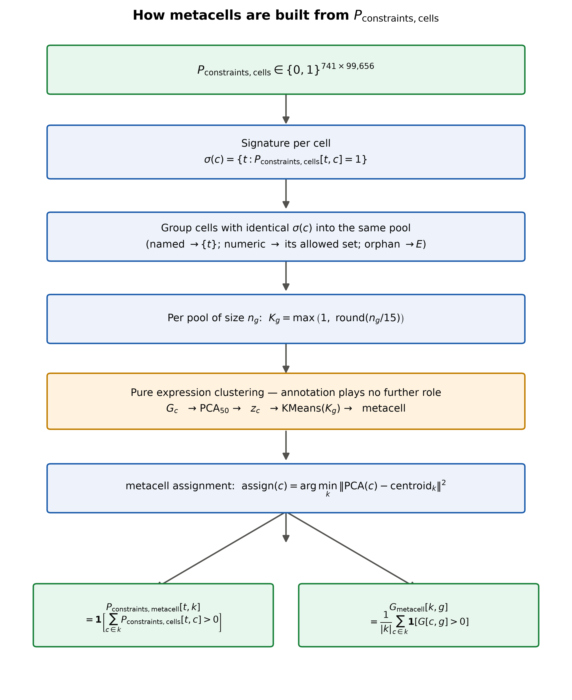

# ConnectionMiner — Fly Connectome Explorer

An interactive hub for the ConnectionMiner project: click into a *Drosophila*
brain map and open live dashboards — UMAP embeddings, confusion matrices,
recovery batteries, and full solver runs — for a pipeline that infers neuron
cell type from gene expression and synaptic wiring across 139,255 neurons
and 50M+ synapses.


*One of the registered experiments: inferred type assignment (UMAP, left) next to the observed connectome and every matrix the solver consumes or produces (right, live Plotly).*

## What's here

- **Home** (`/`) — an animated, clickable brain map; each glowing node opens
  an independent experiment.
- **Registry** (`/registry`) — searchable, filterable list of every
  registered experiment dashboard.
- **Manage** (`/manage`) — register new experiment pages, edit metadata, and
  toggle visibility, without touching code.
- Each **experiment** (`/experiments/$id`) is a self-contained dashboard
  (large pre-built Plotly/HTML bundle) — e.g. UMAP-vs-confusion-matrix views,
  the recovery-battery explainer, or a full solver run with every
  input/output matrix live and hoverable.

### How it works, in brief

Every experiment here visualizes a different stage of the same underlying
pipeline: cells get a soft "which types are even possible" constraint from
expression clustering, get pooled into metacells, and a solver jointly fits
a type assignment and a gene-interaction model so that predicted
connectivity matches the real connectome.

<table>
<tr>
<td></td>
<td></td>
</tr>
</table>

## Development

This repo uses [Bun](https://bun.sh):

```sh
git clone <this-repository-url>
cd connectome
bun install
bun run dev
```

## Built with

- TanStack Start
- TypeScript
- React
- Tailwind CSS

## Deploying to Vercel

1. Push the code to GitHub and import the repo in Vercel.
2. Leave the framework preset as **Other** and the root directory as the repo root.
   `vercel.json` already pins `framework: null` plus the install/build commands, so
   Vercel will not try to serve a static `dist/` folder.
3. Vercel runs `npm run build:vercel` (`NITRO_PRESET=vercel vite build`), which makes
   Nitro emit `.vercel/output` (Build Output API): `static/` for the client assets and
   `functions/__server.func` for the SSR handler, with a catch-all route to it. If the
   build instead prints `dist/server/...`, the preset did not apply and every URL 404s.
   Override `NITRO_PRESET` if you deploy elsewhere.
4. Optional env var:
   - `ASSET_BASE_URL=https://project--3b47e950-dbff-4681-a4b3-0e3c66cfc349.lovable.app`
     — the experiment HTML bundles (16-39 MB each) live on Lovable's asset CDN under
     `/__l5e/...`. That path does not exist on Vercel, so the proxy in
     `src/routes/api/public/experiment.$id.ts` falls back to this absolute base.
     A default is already baked in; set the variable only to point at a different host.

If you'd rather host the bundles yourself, upload the HTML files to any static host
and paste the full `https://…` URLs into the **Manage** page — custom URLs bypass the
proxy entirely.

---

Built with [Lovable](https://lovable.dev).
