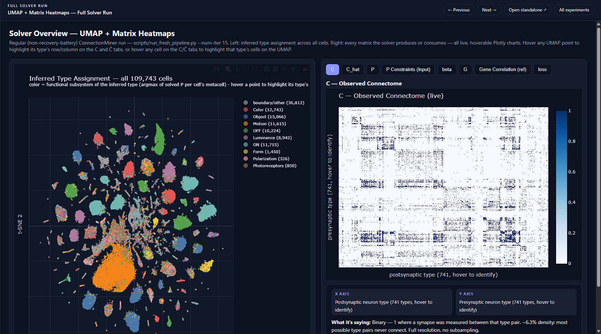
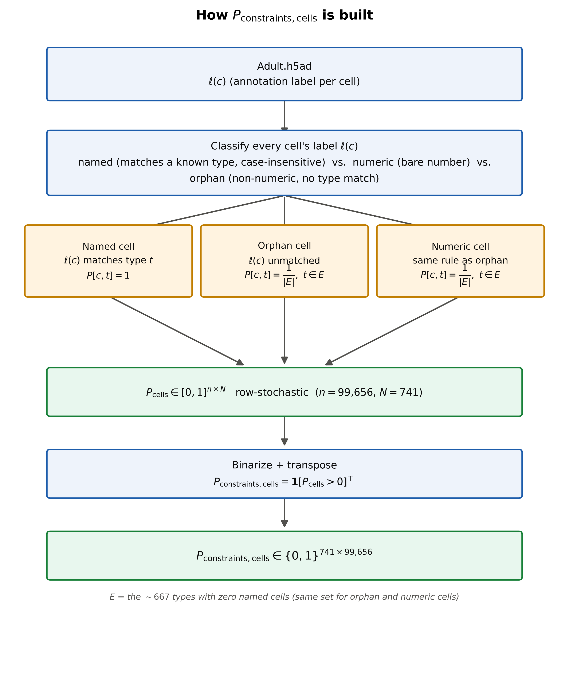

ConnectionMiner
<p align="center">
  
</p>
<h3 align="center">
  Connectome-informed cell-type inference in the <i>Drosophila</i> visual system
</h3>
<p align="center">
  <b>Gene expression × synaptic wiring → cell-type identity</b>
</p>
---
Overview
ConnectionMiner is a computational framework for inferring neuronal cell
types in the Drosophila melanogaster visual system by combining
single-cell gene expression with synaptic connectivity.
Modern transcriptomic atlases can profile roughly 100,000 cells and organize
them into hundreds of expression-based clusters. However, an expression
cluster is not necessarily a biologically resolved cell type.
Closely related neurons can have highly similar transcriptional profiles while
occupying very different positions in the neural circuit.
Connectomics provides an independent source of information.
A neuron is not only defined by the genes it expresses. Its identity is also
reflected in which neurons it connects to and receives connections from.
ConnectionMiner uses this complementary information to resolve cell-type
identity.
> **The central idea:** a cell should be compatible with its cell type both
> molecularly and structurally.
---
The Problem
Single-cell RNA sequencing provides a high-dimensional molecular description
of each neuron:
```text
Cell
 │
 ├── Gene 1
 ├── Gene 2
 ├── Gene 3
 ├── ...
 └── Gene N
```
Unsupervised clustering can then organize cells into transcriptomic
neighborhoods.
However, this creates an important limitation:
```text
Expression space

       Type A
      ● ● ●
    ● ● ● ●

          ● ●
        ● ● ●
        Type B
```
Two biologically distinct cell types can occupy nearly the same region of
expression space.
This means that:
```text
Gene expression
       ↓
Expression cluster
       ↓
Possible cell types
       ↓
?
```
is sometimes insufficient to determine the true identity of a neuron.
---
The Connectome Provides Another View
A connectome represents the wiring diagram of a nervous system.
For every neuron, the connectome can describe:
presynaptic partners,
postsynaptic partners,
synaptic connections,
connection strengths,
circuit neighborhoods,
and higher-order network structure.
In the Drosophila visual system, neurons form highly structured circuits
across regions such as the:
Retina
Lamina
Medulla
Lobula
Lobula plate
This creates a second description of neuronal identity:
```text
Gene expression
      │
      ▼
 Molecular identity
```
and
```text
Synaptic wiring
      │
      ▼
 Circuit identity
```
ConnectionMiner combines both.
---
The ConnectionMiner Idea
Suppose a cell could plausibly belong to either Type A or Type B based
on gene expression.
Expression alone might not be able to distinguish them.
But suppose:
```text
Type A ───────► X
       └──────► Y
       └──────► Z
```
while
```text
Type B ───────► P
       └──────► Q
       └──────► R
```
and the cell's observed connectivity strongly resembles Type A.
Then the connectome provides evidence favoring Type A.
ConnectionMiner formalizes this intuition.
> **A good cell-type assignment should explain both what the cell looks like
> and how the cell is wired.**
---
Joint Inference
ConnectionMiner treats cell-type identification as a joint optimization
problem.
The model simultaneously considers:
Transcriptomic compatibility
Cell-type constraints
Synaptic connectivity
A learned gene-interaction structure
The goal is to find a soft assignment of cells to known cell types that
produces a connectivity structure consistent with the observed connectome.
Conceptually:
```text
             Single-cell RNA-seq
                     │
                     ▼
             Expression space
                     │
                     ▼
          Possible cell-type set
                     │
                     ▼
               Metacells
                     │
                     ▼
        ┌────────────────────────┐
        │     ConnectionMiner    │
        │                        │
        │  Expression + Wiring   │
        └───────────┬────────────┘
                    │
                    ▼
           Cell-type probabilities
                    │
                    ▼
          Predicted connectivity
                    │
                    ▼
          Compare with real
             connectome
```
---
Soft Cell-Type Assignments
ConnectionMiner does not require every cell to be assigned immediately to a
single type.
Instead, each cell receives a probability distribution over the known
cell types.
For example:
Cell type	Probability
Type A	0.72
Type B	0.21
Type C	0.05
Other	0.02
This representation preserves uncertainty and allows closely related cell
types to remain distinguishable until enough evidence is available.
For (N) cells and (K) known cell types, the assignment matrix is:
[
P \in \mathbb{R}^{N \times K}
]
where
[
P_{ik}
]
represents the probability that cell (i) belongs to cell type (k).
Each cell's probabilities satisfy:
[
P_{ik} \geq 0
]
and
[
\sum_k P_{ik} = 1.
]
For ConnectionMiner:
[
K = 741
]
known visual-system cell types are considered as candidate identities.
---
Expression-Based Constraints
The connectome should provide additional information, not override everything
already known from transcriptomics.
ConnectionMiner therefore imposes expression-derived constraints.
A cell is only allowed to receive probability mass from cell types that are
compatible with its expression neighborhood.
Conceptually:
```text
Transcriptomic neighborhood
             │
             ▼
      Candidate cell types
             │
       ┌─────┴─────┐
       │           │
     allowed    forbidden
       │           │
       ▼           ✕
  ConnectionMiner
```
This prevents the connectivity optimization from assigning a cell to a
biologically implausible type simply because that assignment happens to
improve the connectivity objective.
The detailed construction of these constraints and the metacell procedure is
described in:
`P_CONSTRAINTS_AND_METACELLS.md`
<p align="center">
  
</p>
---
Alternating Optimization
ConnectionMiner learns two interacting components.
Cell-type assignment
[
P
]
describes the probability that each cell or metacell belongs to each known
cell type.
Gene-interaction structure
[
M
]
captures how gene-expression information contributes to the predicted
connectivity structure.
The optimization alternates between these components.
Step 1: Fix the cell-type assignments
Given (P), estimate the gene-interaction structure that best explains the
observed connectome.
```text
Cell-type assignments
          │
          ▼
   Learn interaction M
          │
          ▼
 Predicted connectivity
```
Step 2: Fix the interaction structure
Given (M), refine the cell-type assignments so that the predicted
connectivity better agrees with the real connectome while respecting the
expression constraints.
```text
Interaction structure
          │
          ▼
     Refine P
          │
          ▼
 Better cell-type assignments
```
These steps are repeated until the solution converges.
```text
             ┌─────────────────┐
             │ Initial P       │
             └────────┬────────┘
                      │
                      ▼
              Learn interaction M
                      │
                      ▼
              Predict connectivity
                      │
                      ▼
               Refine assignment P
                      │
                      ▼
                   Repeat
                      │
                      ▼
                 Convergence
```
---
Why Metacells?
The transcriptomic atlas contains approximately 100,000 cells.
Running a full optimization independently at that scale is computationally
expensive and can introduce unnecessary noise.
ConnectionMiner therefore first constructs approximately 5,300 metacells.
A metacell is a small collection of cells that are:
transcriptionally homogeneous,
located in a similar expression neighborhood,
and compatible with similar candidate cell types.
The reduction is approximately:
[
100,000\ \text{cells}
\rightarrow
5,300\ \text{metacells}
]
The expensive optimization is performed at the metacell level.
The resulting solution is then expanded back to:
```text
Metacells
   │
   ▼
Raw expression clusters
   │
   ▼
Individual cells
```
This provides a computationally manageable representation while preserving
the biological structure needed for inference.
---
The Full Pipeline
```text
                  ┌──────────────────────┐
                  │ Single-cell atlas    │
                  │ ~100K cells          │
                  └──────────┬───────────┘
                             │
                             ▼
                  ┌──────────────────────┐
                  │ Expression-based     │
                  │ constraints          │
                  └──────────┬───────────┘
                             │
                             ▼
                  ┌──────────────────────┐
                  │ ~5,300 metacells     │
                  └──────────┬───────────┘
                             │
                             │
                ┌────────────▼────────────┐
                │                         │
                │    ConnectionMiner      │
                │                         │
                │  Expression + Connectome│
                │                         │
                └────────────┬────────────┘
                             │
                             ▼
                  ┌──────────────────────┐
                  │ Metacell × type      │
                  │ probability matrix   │
                  └──────────┬───────────┘
                             │
                             ▼
                  ┌──────────────────────┐
                  │ Expand back to       │
                  │ individual cells     │
                  └──────────┬───────────┘
                             │
                             ▼
                  ┌──────────────────────┐
                  │ Final cell-type      │
                  │ probabilities        │
                  └──────────────────────┘
```
---
Validation
ConnectionMiner is evaluated from two complementary perspectives.
1. Recovery of Known Cell Types
Some transcriptomic clusters already have confident biological type
annotations.
These labels can be treated as held-out ground truth and hidden during the
inference process.
ConnectionMiner currently recovers:
[
\boxed{74/74 = 100%}
]
of the evaluated named clusters.
This asks:
> **Can the method recover known biological identities without directly
> being given those identities?**
---
2. Connectome Reconstruction
The inferred cell-type assignments can also be used to reconstruct a
connectivity structure.
The reconstructed network is compared with the actual connectome.
ConnectionMiner currently achieves:
[
\boxed{\mathrm{AUC}=0.86}
]
for separating true synaptic type-pairs from unconnected pairs.
This asks:
> **Do the inferred cell identities actually explain the observed wiring
> diagram?**
---
Why Both Metrics Matter
The two evaluations probe different failure modes.
Evaluation	Question
Known-type recovery	Does the model recover biological cell identity?
Connectome AUC	Does the inferred identity structure explain wiring?
A model could potentially perform well using only transcriptomic similarity
while failing to explain connectivity.
Conversely, a model could potentially exploit connectivity while producing
biologically implausible expression assignments.
ConnectionMiner is designed to satisfy both constraints.
---
The Biological Intuition
A useful way to think about ConnectionMiner is that neuronal identity exists
in multiple spaces.
```text
                    Neuron identity
                         │
             ┌───────────┴───────────┐
             │                       │
             ▼                       ▼
       Molecular space         Circuit space
             │                       │
             ▼                       ▼
      Gene expression          Synaptic wiring
             │                       │
             └───────────┬───────────┘
                         │
                         ▼
                 Cell-type identity
```
Gene expression captures the molecular program of a neuron.
Connectivity captures its role in the circuit.
ConnectionMiner asks whether these two views can constrain each other.
---
Drosophila Visual System
The Drosophila visual system is an especially useful setting for this
approach because it combines:
hundreds of distinct neuronal types,
highly structured circuit architecture,
stereotyped synaptic connectivity,
large-scale electron-microscopy reconstructions,
and extensive transcriptomic profiling.
The optic lobe contains multiple layers of visual processing, including the
lamina, medulla, lobula and lobula plate.
Information is transformed across these layers through large networks of
repeated and highly specialized neuronal types.
This makes connectivity particularly informative when transcriptomic
signatures alone are insufficient.
---
Connectome Context
ConnectionMiner builds on recent advances in Drosophila connectomics,
including large-scale reconstruction of neurons and their synaptic
relationships.
The FlyWire connectome provides a near-complete wiring diagram of the adult
Drosophila brain, including approximately 140,000 proofread neurons and
more than 50 million synapses.
The broader connectomics ecosystem provides:
neuron reconstructions,
synaptic connections,
cell-type annotations,
optic-lobe circuit structure,
and tools for interactive network exploration.
These resources make it possible to connect transcriptomic identity with
actual circuit structure.
---
Repository Structure
```text
ConnectionMiner/
│
├── data/
│   ├── Adult.h5ad
│   ├── cell-type catalogue
│   ├── connectome
│   └── root-ID / type mappings
│
├── cm_visual/
│   ├── metacell construction
│   ├── ConnectionMiner solver
│   ├── CPU backend
│   ├── GPU / Torch backend
│   └── pipeline components
│
├── scripts/
│   ├── preprocessing
│   ├── solver pipeline
│   ├── downstream analyses
│   ├── cell-type mixing experiments
│   └── dashboard generation
│
├── output/
│   ├── solver results
│   ├── matrices
│   ├── heatmaps
│   ├── CSV outputs
│   └── interactive visualizations
│
├── connectome/
│   └── interactive connectome explorer
│
├── assets/
│   ├── drosophila_connectome.png
│   ├── optic_lobe_connectome.png
│   └── drosophila_visual_system.png
│
├── P_CONSTRAINTS_AND_METACELLS.md
└── README.md
```
---
Main Outputs
ConnectionMiner produces several downstream data products.
Cell × Cell-Type Probability Matrix
A probability matrix describing the inferred identity of every cell:
[
P_{\text{cell}\times\text{type}}
]
Each row represents one cell and each column represents one of the 741
candidate visual-system cell types.
---
Metacell-Level Solution
The compact solution obtained during the primary optimization stage.
This representation is useful for:
inspecting the global inference,
evaluating uncertainty,
visualizing cell-type structure,
and performing downstream analyses.
---
Predicted Connectivity
The inferred cell-type assignments can be projected back into connectivity
space to generate a predicted network.
This allows direct comparison between:
```text
Observed connectome
        vs.
Predicted connectome
```
---
Validation Results
The repository contains outputs for evaluating:
known cell-type recovery,
connectome reconstruction,
pairwise connectivity discrimination,
cell-type mixing experiments,
and downstream analyses.
---
Interactive Exploration
The repository also includes a separate connectome visualization application.
The interactive explorer is designed to make it possible to inspect:
cell-type assignments,
connectivity patterns,
experimental results,
neuron pairs,
and inferred relationships between transcriptomic and connectomic
structure.
The visualization application lives in:
```text
connectome/
```
and is maintained as a separate web application.
---
What ConnectionMiner Adds
Traditional transcriptomic annotation can be summarized as:
```text
Gene expression
      ↓
Expression cluster
      ↓
Cell type
```
ConnectionMiner adds circuit information:
```text
                  Gene expression
                        │
                        ▼
                Possible identities
                        │
                        │
                        ▼
                ┌───────────────┐
                │ ConnectionMiner│
                └───────┬───────┘
                        │
                        ▲
                        │
                 Synaptic wiring
                        │
                        ▼
                   Connectome
```
The result is an annotation framework where molecular similarity and
circuit similarity constrain each other.
---
Key Results
Metric	Result
Candidate visual-system types	741
Transcriptomic cells	~100,000
Metacells	~5,300
Held-out named clusters recovered	74 / 74
Cell-type recovery	100%
Connectome pair discrimination	AUC 0.86
---
Project Goal
The central question behind ConnectionMiner is:
> **Can neuronal identity be inferred more accurately by jointly modeling
> molecular expression and circuit connectivity?**
Rather than treating transcriptomics and connectomics as independent
annotation systems, ConnectionMiner treats them as complementary observations
of the same underlying biological identity.
The long-term goal is to move from:
```text
Unknown / ambiguous transcriptomic cluster
```
to:
```text
Connectome-informed cell-type distribution
```
for every neuron in the Drosophila visual system.
---
Research Perspective
ConnectionMiner sits at the intersection of:
single-cell genomics,
computational neuroscience,
connectomics,
representation learning,
graph inference,
and cell-type annotation.
The broader motivation is that neuronal identity is inherently multidimensional.
A neuron has:
```text
Molecular properties
        +
Morphological properties
        +
Connectivity properties
        +
Functional properties
```
ConnectionMiner focuses on the first and third of these:
[
\boxed{
\text{Gene expression}
\quad+\quad
\text{Synaptic connectivity}
}
]
and asks whether combining them can reveal cell identity that neither source
can resolve reliably on its own.
---
References
FlyWire
Dorkenwald et al.  
Neuronal wiring diagram of an adult brain.  
Nature, 2024.
Drosophila Visual System Connectomics
Recent connectomic studies have produced detailed inventories of neuronal
types and their synaptic relationships across the Drosophila visual system.
Connectome Exploration
The FlyWire and Codex ecosystems provide interactive tools for exploring
reconstructed neurons, annotations, and synaptic connections.
---
Acknowledgements
ConnectionMiner builds upon publicly available Drosophila transcriptomic
and connectomic resources, including data generated by the broader
FlyWire/connectomics community.
---
<p align="center">
  <br>
  <b>ConnectionMiner</b>
  <br>
  <i>Inferring neuronal identity from molecular expression and circuit wiring.</i>
  <br><br>
  🧬 × 🕸️ → 🧠
</p>
